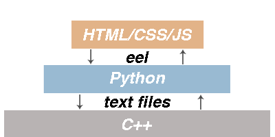
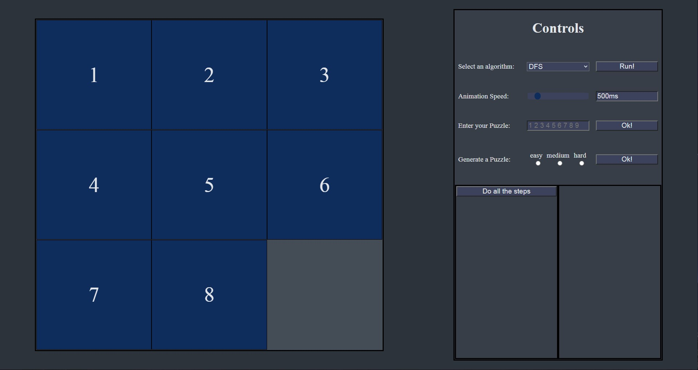
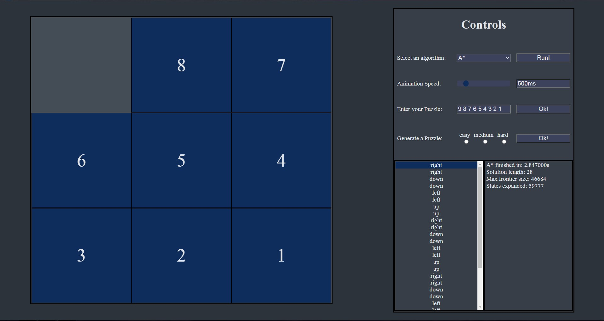

# 8-puzzle-solver

<h1> What is it!? </h1>

 
	8-puzzle-solver is a tool that uses the most famous euristic and non euristic AI algorithms to find a solution to the 8-puzzle problem.  
	It comes with a GUI that let's you enter your puzzle or generate a random one and select an algorithm of your choice to solve it.  
	It also desplays bentchmarks such as memory used for the frontier set or the CPU time it took to find the solution.

<h1> How it works?! </h1>

	The AI algorithms and the whole logic is implemented in C++. There's a Python program that exchanges data with that C++ program by writing/reading data to/from some common
	text files (sockets are too fancy :stuck_out_tongue_winking_eye:).   That Python script also hosts a little local web server by using a small library called <b> eel 	</b>.
	This web server of the Python script hosts a page that's actually the GUI to the C++ program (Electron is too fancy :stuck_out_tongue_winking_eye:).   So that's it! You've 	   learned every single detail!
	

		
	

<h1> Screenshots </h1>

	
  

	
  

<h1> How to build it? </h1>

	Just take all files inside the C++ directory. Put them in a project and compile them all together.  
	After that, get the executable produced, and put it in the directory of the app.py and the web page.  
	That's it! Just run app.py and use the GUI.

<h1> Don't wanna build it?! </h1>

    Don't worry. I have relased a version with two executables. Just run 8-puzzle.exe, AI.exe is the the C++ Logic builded.  
    These exes can be found in <a href=""> Here </a>.
 
